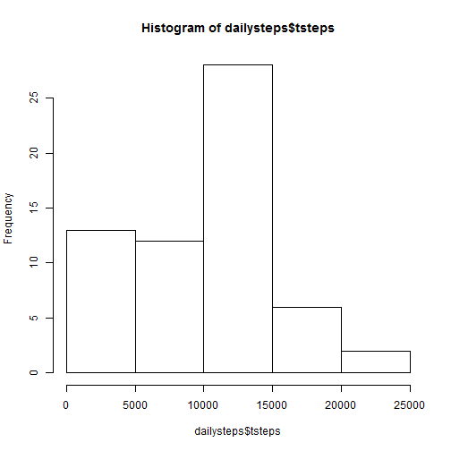
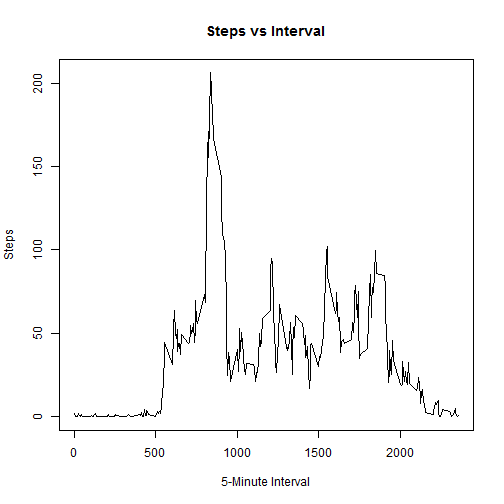
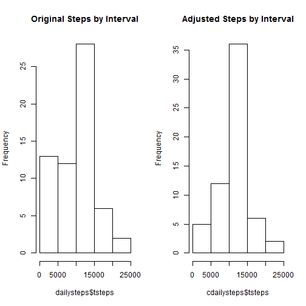

## Loading and preprocessing the data

First, we will load and preprocess the data. Since the data is included in the
original repository, there is no need to download the dataset within R.


```r
library(data.table)

## then read the data, forcing colClasses

data <- read.table(
        unz("activity.zip", "activity.csv"),
        header = T,
        sep = ",",
        colClasses = c("numeric", "factor", "numeric")
)

data$datePOSIX <- as.Date(data$date, "%Y-%m-%d")
```

## What is mean total number of steps taken per day?

First we'll calculate total steps taken per day, and mean and median of steps
per day


```r
dailysteps <- data.frame(
        date = character(),
        tsteps = character()
)
        
for (x in unique(data$date)) {
        total <- sum(data$steps[data$date == x], na.rm = T)
        mean <- mean(data$steps[data$date == x], na.rm = T)
        dailysteps <- rbind(dailysteps, data.frame(
                date = x,
                tsteps = total,
                mnsteps = mean
        ))
}
```

Here the total steps per day


```r
dailysteps[, c("date", "tsteps")]
```

```
##          date tsteps
## 1  2012-10-01      0
## 2  2012-10-02    126
## 3  2012-10-03  11352
## 4  2012-10-04  12116
## 5  2012-10-05  13294
## 6  2012-10-06  15420
## 7  2012-10-07  11015
## 8  2012-10-08      0
## 9  2012-10-09  12811
## 10 2012-10-10   9900
## 11 2012-10-11  10304
## 12 2012-10-12  17382
## 13 2012-10-13  12426
## 14 2012-10-14  15098
## 15 2012-10-15  10139
## 16 2012-10-16  15084
## 17 2012-10-17  13452
## 18 2012-10-18  10056
## 19 2012-10-19  11829
## 20 2012-10-20  10395
## 21 2012-10-21   8821
## 22 2012-10-22  13460
## 23 2012-10-23   8918
## 24 2012-10-24   8355
## 25 2012-10-25   2492
## 26 2012-10-26   6778
## 27 2012-10-27  10119
## 28 2012-10-28  11458
## 29 2012-10-29   5018
## 30 2012-10-30   9819
## 31 2012-10-31  15414
## 32 2012-11-01      0
## 33 2012-11-02  10600
## 34 2012-11-03  10571
## 35 2012-11-04      0
## 36 2012-11-05  10439
## 37 2012-11-06   8334
## 38 2012-11-07  12883
## 39 2012-11-08   3219
## 40 2012-11-09      0
## 41 2012-11-10      0
## 42 2012-11-11  12608
## 43 2012-11-12  10765
## 44 2012-11-13   7336
## 45 2012-11-14      0
## 46 2012-11-15     41
## 47 2012-11-16   5441
## 48 2012-11-17  14339
## 49 2012-11-18  15110
## 50 2012-11-19   8841
## 51 2012-11-20   4472
## 52 2012-11-21  12787
## 53 2012-11-22  20427
## 54 2012-11-23  21194
## 55 2012-11-24  14478
## 56 2012-11-25  11834
## 57 2012-11-26  11162
## 58 2012-11-27  13646
## 59 2012-11-28  10183
## 60 2012-11-29   7047
## 61 2012-11-30      0
```

And then plot it on a histogram


```r
hist(dailysteps$tsteps)
```

 

And then the mean and median for total daily steps


```r
print(paste("Mean:", mean(dailysteps$tsteps, na.rm = T)))
```

```
## [1] "Mean: 9354.22950819672"
```

```r
print(paste("Median:", median(dailysteps$tsteps, na.rm = T)))
```

```
## [1] "Median: 10395"
```


## What is the average daily activity pattern?

Now let's see step trends by time over all dates


```r
## prepping the data first

intervalsteps <- data.frame(
        interval = character(),
        tsteps = character(),
        mnsteps = character()   ## mean steps
)
        
for (x in unique(data$interval)) {
        total <- sum(data$steps[data$interval == x], na.rm = T)
        mean <- mean(data$steps[data$interval == x], na.rm = T)
        intervalsteps <- rbind(intervalsteps, data.frame(
                interval = x,
                tsteps = total,
                mnsteps = mean        
        ))
}


## then creating the plot

plot(
        intervalsteps$interval,
        intervalsteps$mnsteps,
        type = "l",
        xlab = "5-Minute Interval",
        ylab = "Steps",
        main = "Steps vs Interval"
)
```

 

Looks nice. Clearly there's some kind of trend toward greater activity in the
morning.

The interval with the highest activity is:


```r
m <- max(intervalsteps$mnsteps, na.rm = T)
print(paste(
        "Max: interval",
        intervalsteps$interval[intervalsteps$mnsteps == m],
        "at", m, "mean steps"
))
```

```
## [1] "Max: interval 835 at 206.169811320755 mean steps"
```

## Imputing missing values

There are a number of missing values from this dataset. In total there are:


```r
sum(is.na(data$steps))
```

```
## [1] 2304
```

Let's fill in these values. Should we use the mean daily steps, or mean steps
for the interval?


```r
print(paste("SD of steps by day:", sd(dailysteps$mnsteps, na.rm = T)))
```

```
## [1] "SD of steps by day: 14.8235433773695"
```

```r
print(paste("SD of steps by interval:", sd(intervalsteps$mnsteps, na.rm = T)))
```

```
## [1] "SD of steps by interval: 38.6643359278229"
```

There is greater variability by interval, so we'll use that to backfill our NA
values.


```r
dataclean <- data

for (x in 1:nrow(dataclean)) {
        if (is.na(dataclean$steps[x])) {
                dataclean$steps[x] <- intervalsteps$mnsteps[match(dataclean$interval[x], intervalsteps$interval)]
        }
}

## This was a tough one
```

Let's do the same analysis we did in #1 above, but against our clean dataset.


```r
cdailysteps <- data.frame(
        date = character(),
        tsteps = character()
)
        
for (x in unique(dataclean$date)) {
        total <- sum(dataclean$steps[dataclean$date == x], na.rm = T)
        mean <- mean(dataclean$steps[dataclean$date == x], na.rm = T)
        cdailysteps <- rbind(cdailysteps, data.frame(
                date = x,
                tsteps = total,
                mnsteps = mean
        ))
}
```

And then plot it on a histogram, along with our original data.


```r
par(mfrow = c(1,2))

hist(dailysteps$tsteps)

hist(cdailysteps$tsteps)
```

 

And compare the mean and median between the two sets.


```r
print(paste("Original Mean:", mean(dailysteps$tsteps, na.rm = T)))
```

```
## [1] "Original Mean: 9354.22950819672"
```

```r
print(paste("Clean Mean:", mean(cdailysteps$tsteps, na.rm = T)))
```

```
## [1] "Clean Mean: 10766.1886792453"
```

```r
print(paste("Original Median:", median(dailysteps$tsteps, na.rm = T)))
```

```
## [1] "Original Median: 10395"
```

```r
print(paste("Clean Median:", median(cdailysteps$tsteps, na.rm = T)))
```

```
## [1] "Clean Median: 10766.1886792453"
```

Looks like what we would expect. The distribution is roughly similar, but we
have removed many of the NA values which skewed the number of days with low
steps higher. Since we've replaced irrelevant data with data that was based on
the mean of the existing distribution, it shouldn't be surprising that it's
similar.

## Are there differences in activity patterns between weekdays and weekends?

Good question, let's see.

First add a column to our clean dataset which breaks out weekday/weekend.


```r
library(chron)

dataclean$weekday[is.weekend(dataclean$datePOSIX) == FALSE] <- "weekday"
dataclean$weekday[is.weekend(dataclean$datePOSIX) == TRUE] <- "weekend"
```

Now let's plot the averages over the interval periods


```r
library(plyr)

cintervalsteps <- data.frame(
        interval = character(),
        tsteps = character(),
        mnsteps = character(),   ## mean steps
        weekday = factor()
)
        
for (x in unique(dataclean$interval)) {
        total <- sum(dataclean$steps[dataclean$interval == x & dataclean$weekday == "weekday"], na.rm = T)
        mean <- mean(dataclean$steps[dataclean$interval == x & dataclean$weekday == "weekday"], na.rm = T)
        cintervalsteps <- rbind(cintervalsteps, data.frame(
                interval = x,
                tsteps = total,
                mnsteps = mean,
                weekday = as.factor("weekday")
        ))
}

for (x in unique(dataclean$interval)) {
        total <- sum(dataclean$steps[dataclean$interval == x & dataclean$weekday == "weekend"], na.rm = T)
        mean <- mean(dataclean$steps[dataclean$interval == x & dataclean$weekday == "weekend"], na.rm = T)
        cintervalsteps <- rbind(cintervalsteps, data.frame(
                interval = x,
                tsteps = total,
                mnsteps = mean,
                weekday = as.factor("weekend")
        ))
}


library(lattice)

xyplot(mnsteps ~ interval | weekday, 
           data = cintervalsteps,
           type = "l",
           xlab = "Interval",
           ylab = "Number of steps",
           layout=c(1,2))
```

 

## That's it!
